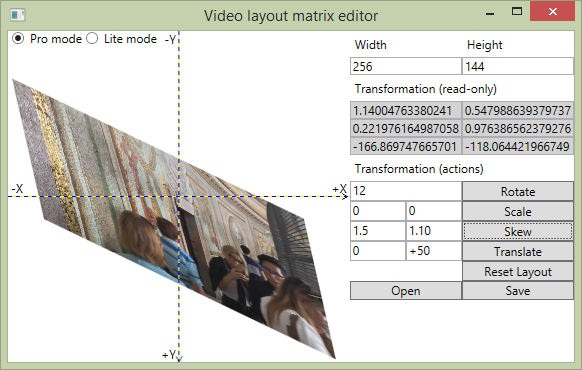

# VisiMatrix

VisiMatrix is an application to modify the transform matrix embedded in MP4 (and technically - MOV) files. 

Speaking simply, **it allows you to rotate MP4 video file without any transcoding**.

## Typical usage

Say, you shot video with your phone top-down, but gyroscope decided it was portrait mode, while it should be actually landscape.  
Or, your video was shot in action and gravity sensor got confused.  
In other words, the video stream itself is fine, but video appears turned 90 degrees left or right.  
This is the original problem VisiMatrix is designed to address.  

## Explanation

Video in phones is always recorded to file in landscape orientation - because this is how your sensor is oriented.  
But then the metadata is read from gravity or acceleration sensor, or compass, and they dictate how the phone **and other players** must represent the video frame.  
This information is put into MP4 file in a form of a special matrix 3x3.   
Upon playback, players read this matrix and already after processing the frame in decoder applies lightweight matrix transformation to the represented image.  
That's why if you shoot portrait, you see it portrait in Media Player Classic, Windows Media Player, Youtube... they all read the same matrix.  
This matrix is nothing special, just a regular transformation matrix. See Wikipedia for details.

## The app

VisiMatrix reads the matrix from the file and allows you to change it directly in the file.  
In the simple mode, there is a blue rectangle which visually represent the video frame.  
By default it should be in right-down square.  
On load, VisiMatrix applies the transform matrix from video file to the rectangle, just like players do, so you can see how your image is transformed.  
There are quick buttons to rotate it 0 ("Reset layout"), 90, 180 or 270 degrees.  
And one button to save.  
Simple, eh?  
Oh, yes, also Width and Height. Ignore them, they are only to show the box, don't affect video.
VisiMatrix saves changes directly into the loaded file, and this happens immediately.

## Pro mode

2 features available in Pro mode:

1. It loads the video itself instead of blue rectangle. This is buggy feature and sometimes it prevents the file from being updated.
2. It allows you to do all the possible changes available to transform matrix: free rotation, skew, translate and scale. This feature is supported by the concept of Matrix itself, but not always supported by media players. All the changes are previewed in real time.

And don't worry, Pro mode is free of charge, just like Lite mode.

## What about MOV?

So, the MP4 file container is based on Apple MOV, just bit more standardized version.  
Which means, _in theory_ it should work the same way for MOVs. I didn't test. Use for your own risk.

## What's up with the code? Why so many low-level bit manipulations?

Apple likes to do the things their way. In most cases it means "not like Windows". So I had to rewrite a lot of basic binary operations here.

## Is it stable? Is it safe to use it?

Of course NOT! It's never-finished beta of proof-of-concept for canceled Windows Phone app.   
I don't recommend Pro mode, your own risk.  
Remember, **IT WRITES STRAIGHT TO YOUR FILES**, so all backups and safety precautions are also to your sole discretion.  
Not only I don't provide ANY guarantee for the stable work of this, I CAN guarantee that one day it WILL go wrong.  
In other words - **USE WITH EXTREME CAUTION**. 
